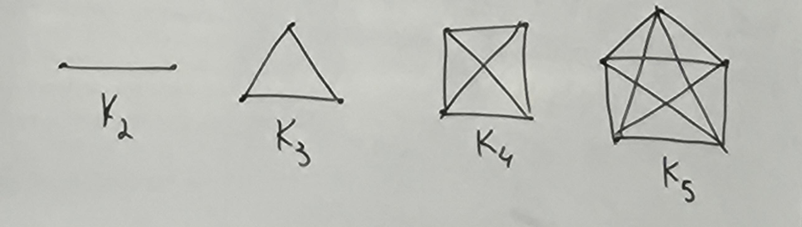
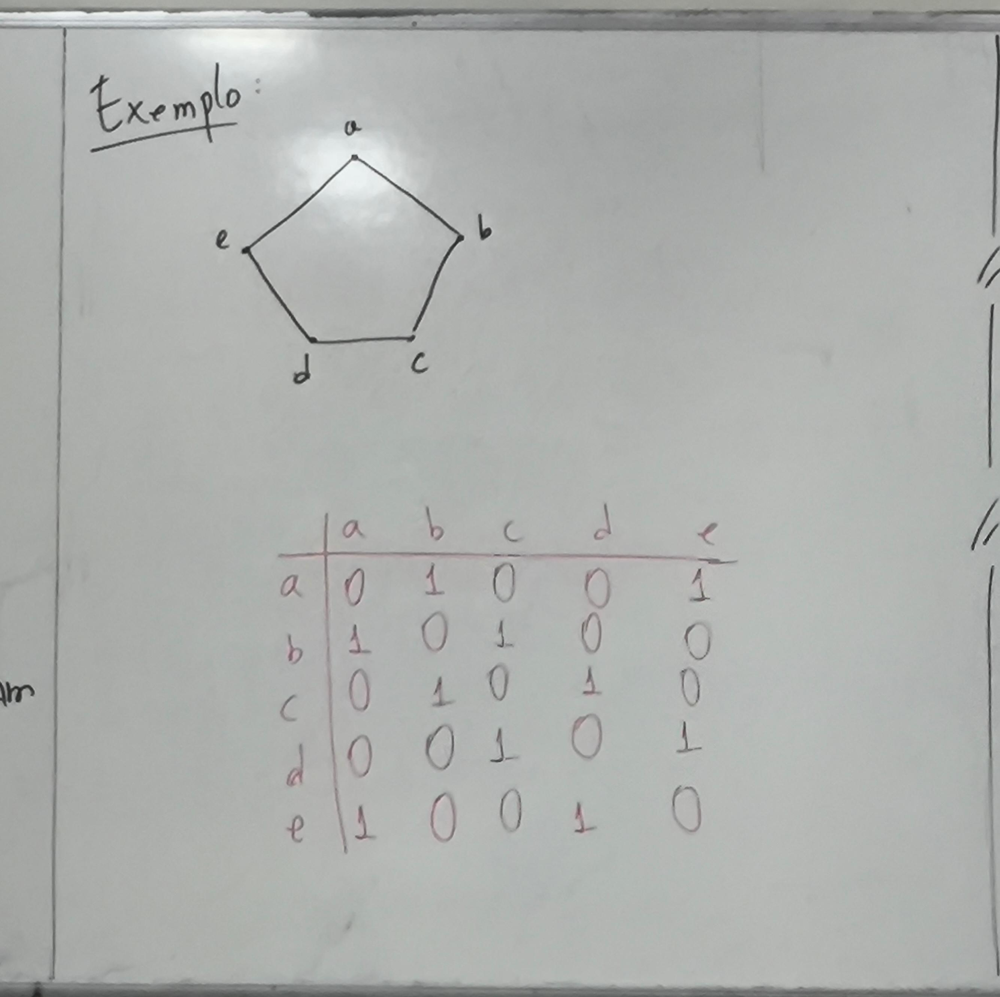
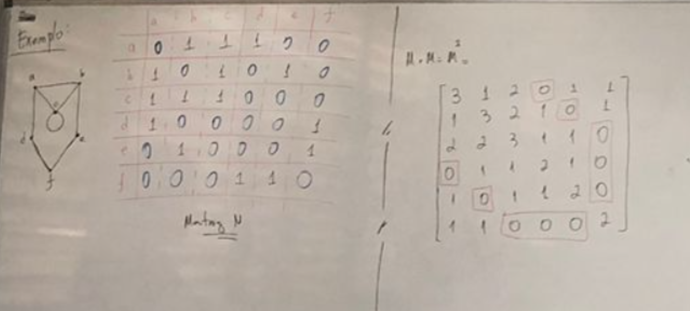
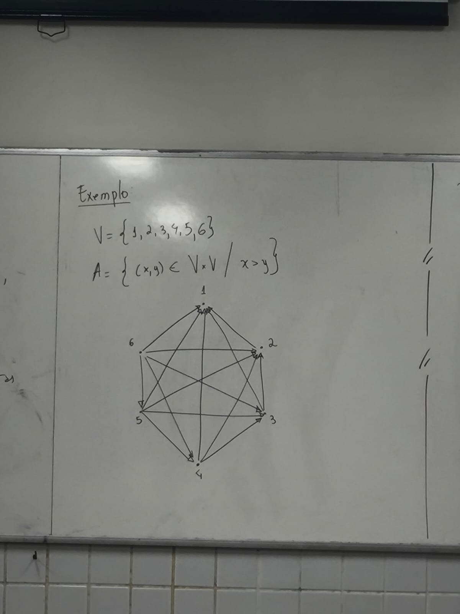
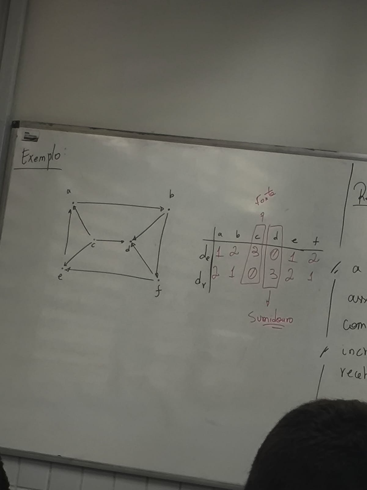
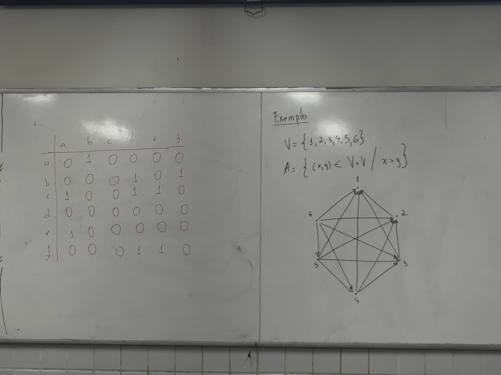
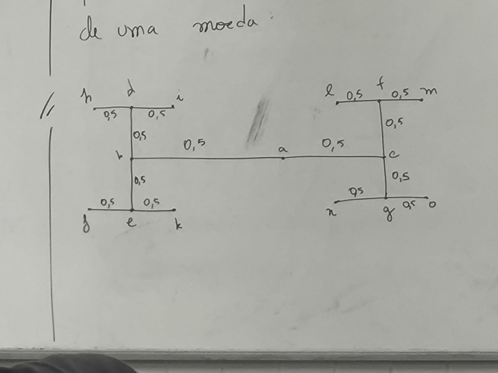

# GRAFOS

Um **grafo** G é formado por:

- um conjunto **não vazio** V de vértices (ou nós)
- um conjunto A de pares **não ordenados** de elementos de V, chamados de arestas

Ou seja:

G = (V, A)

---

## Exemplos

### A)
V = {v1, v2, v3, v4, v5}
A = {(v1, v2), (v1, v3), (v2, v4), (v3, v5)}

---

### B)
V = {1, 2, 3, 4, 5}
A = {(i, j) | i = j + 2}

Ou seja:
A = {(1,3), (2,4), (3,5)}

---

### C)
V = {1, 2, 3, 4}
A = {(1,2), (1,3), (2,3), (2,2), (4,4)}

Observação:
- (2,2) e (4,4) são loops

---

### D)
V = {1, 2, 3, 4, 5}
A = {} (grafo sem arestas)

---

## Definição 01: Ordem e tamanho

- Número de vértices: |V|
- Número de arestas: |A|

### Exemplo (A)

|V| = 5
|A| = 4

---

## Aplicação: Copa do Mundo

Cada grupo tem 4 seleções, e todas jogam entre si.

Número de jogos em um grupo:
6 jogos

Como são 16 grupos:

16 × 6 = 96 jogos

---

## Definição 02: Conceitos básicos

- Se (x, y) é uma aresta:
  - x e y são **extremidades**

- Se um vértice está ligado a uma aresta:
  - ele é **incidente**

- Se dois vértices compartilham uma aresta:
  - são **adjacentes**

- Se são adjacentes:
  - são **vizinhos**

- Conjunto dos vizinhos de x:
  - N(x)

- Se não são adjacentes:
  - são **independentes**

- Se um vértice não possui arestas:
  - é **isolado**

- Se uma aresta liga um vértice a ele mesmo:
  - é um **loop**

- Se existem várias arestas entre dois vértices:
  - são **multi-arestas**

---

## Definição 03: Grafo simples

Um grafo é **simples** quando:

- não possui loops
- não possui multi-arestas

---

## Definição 04: Grau de um vértice

O grau de um vértice v, denotado por d(v), é o número de arestas incidentes a ele.

IMPORTANTE:
- um loop conta como 2 no grau

---

### Exemplo

V = {a, b, c, d, e, f}
A = {(a,d), (a,c), (b,f), (c,d), (c,e), (c,f)}

#### b) O grafo é simples?
Sim, pois não possui loops nem multi-arestas.

#### c) Grau dos vértices

d(a) = 2
d(b) = 1
d(c) = 4
d(d) = 2
d(e) = 1
d(f) = 2

---

## Teorema

A soma dos graus de todos os vértices é sempre par.

---

## Corolário

O número de vértices de grau ímpar é sempre par.

---

## Definição 05: Subgrafo

Um subgrafo H de G é tal que:

- V(H) ⊆ V(G)
- A(H) ⊆ A(G)

E:
se (x, y) ∈ A(H), então x e y pertencem a V(H)

---

## Definição 06: Grafo k-regular

Um grafo é k-regular quando:

- todos os vértices têm o mesmo grau k

Ou seja:

d(v) = k para todo v em V

---

## Definição 07:
Um grafo simples G é dito **completo** se para cada par de vértice de G, existe uma aresta que os conectam. Denomina-se Kn.

### Propriedades de um Kn:
  - Todos os vértices de um Kn tem grau (n-1)
  - Kn tem a maior quantidade de arestas de um grafo simples com n vértices.
  - Kn possui exatamente:
    - ||Kn|| = N(N - 1) / 2 Arestas
  - Propriedade de Grafos:

## Representação de Grafos

## Definição 8:
A **Matriz de Adjacência** M(G) é uma matriz n x n na qual o vértice Vj, é representado pela coluna j, e os elementos Mij representam a quantidade de arestas que conectam o vértice Vi ao Vj.

### Exemplo:

### Percusos Distintos (Aplicação Direta):
Considere M a matriz de adjacência de um grafo G. Então M², M³, M^4 ... M^k representam, em seus elementos, a quantidade distinta de percursos entre quaisquer dois vértices com 2, 3, 4, ... k passos.

Exemplo:

## Definição 09:
**Dígrafo**:
  Um Grafo orientado, ou **dígrafo**, representado por G = (V, A) com V sendo um conjunto não vazio de vértices e A um conjunto de Arestas orientadas.

Exemplo:

## Definição 10:
a) O grau de emissão de vi é a quantidade de Arestas que **saem** de vi

b) O grau de recepção Dr(vi) é a quantidade de arestas que **chegam** de vi

c) Um vértice **sumidouro** vi é um vértice com de(vi) = ∅

d) Um vértice **fonte** vi é um vértice com dr(vi) = ∅

Exemplo:

### Representação:
Representado por M(c) como sendo a matriz de elementos Aij que associa a cada vértice i (emissos) com o vértice j (receptor) com o incremento (Aij). O elemento Aij recebe o valor de ∅

## Definição 11:
  Um **grafo valorado** G(V,A,w) é um grafo no qual cada aresta tem um número associado. Estes números são representados por w(vi, vj)

Exemplo:
Desenhe um grafo que representa as possibilidades de resultados em três lançamentos de uma moeda:

