#  Grafos — Guia Completo de Estudo
> **Algoritmos e Estrutura de Dados II**
> Guia colaborativo para a prova

---

## 📌 Índice Rápido

| # | Tópico |
|---|--------|
| 1 | [O que é um Grafo?](#1-o-que-é-um-grafo) |
| 2 | [Ordem e Tamanho](#2-ordem-e-tamanho) |
| 3 | [Conceitos Básicos](#3-conceitos-básicos) |
| 4 | [Grafo Simples](#4-grafo-simples) |
| 5 | [Grau de um Vértice](#5-grau-de-um-vértice) |
| 6 | [Subgrafo](#6-subgrafo) |
| 7 | [Grafo k-Regular](#7-grafo-k-regular) |
| 8 | [Grafo Completo (Kn)](#8-grafo-completo-kn) |
| 9 | [Matriz de Adjacência](#9-matriz-de-adjacência) |
| 10 | [Dígrafo](#10-dígrafo) |
| 11 | [Grafo Valorado](#11-grafo-valorado) |
| 12 | [Grafo Complementar](#12-grafo-complementar) |
| 13 | [Grafo Bipartido](#13-grafo-bipartido) |
| 14 | [Isomorfismo](#14-isomorfismo) |
| 15 | [Coloração de Grafos](#15-coloração-de-grafos) |
| 16 | [Percursos em Grafos](#16-percursos-em-grafos) |
| 17 | [Grafo Conectado](#17-grafo-conectado) |
| 18 | [Circuito Euleriano](#18-circuito-euleriano) |
| 19 | [Ciclo Hamiltoniano](#19-ciclo-hamiltoniano) |
| 20 | [Vértice de Corte e Fórmula de Euler](#20-vértice-de-corte-e-fórmula-de-euler) |
| 21 | [Planaridade](#21-planaridade) |
| ⚙️ | [Problemas Clássicos](#️-problemas-clássicos) |

---

## 1. O que é um Grafo?

Um **grafo** G é uma estrutura formada por:

- Um conjunto **não vazio** `V` de **vértices** (também chamados de nós)
- Um conjunto `A` de **arestas** — pares **não ordenados** de elementos de `V`

```
G = (V, A)
```

> 💡 **Pense assim:** vértices são as "cidades" e arestas são as "estradas" entre elas.

---

### 🔎 Exemplos Comentados

**Exemplo A — Grafo comum:**
```
V = {v1, v2, v3, v4, v5}
A = {(v1,v2), (v1,v3), (v2,v4), (v3,v5)}
```
4 arestas conectando 5 vértices. Simples e direto.

---

**Exemplo B — Arestas definidas por regra:**
```
V = {1, 2, 3, 4, 5}
A = {(i,j) | i = j + 2}  →  A = {(1,3), (2,4), (3,5)}
```
A condição `i = j + 2` gera automaticamente as arestas.

---

**Exemplo C — Grafo com loops:**
```
V = {1, 2, 3, 4}
A = {(1,2), (1,3), (2,3), (2,2), (4,4)}
```
⚠️ `(2,2)` e `(4,4)` são **loops** — arestas que ligam um vértice a ele mesmo.

---

**Exemplo D — Grafo vazio (sem arestas):**
```
V = {1, 2, 3, 4, 5}
A = {}
```
Vértices existem, mas nenhuma conexão entre eles.

---

## 2. Ordem e Tamanho

| Conceito | Notação | Significado |
|----------|---------|-------------|
| **Ordem** | `\|V\|` | Número de vértices |
| **Tamanho** | `\|A\|` | Número de arestas |

**Exemplo (usando o Exemplo A acima):**
```
|V| = 5
|A| = 4
```

---

### 🏆 Aplicação: Copa do Mundo

> Em cada grupo com 4 seleções, todas jogam entre si. Quantos jogos?

Isso é equivalente a contar as arestas de um K₄ (grafo completo com 4 vértices):

```
Jogos por grupo = 4×3/2 = 6 jogos
16 grupos × 6 jogos = 96 jogos no total
```

---

## 3. Conceitos Básicos

| Termo | Definição |
|-------|-----------|
| **Extremidades** | Os dois vértices de uma aresta `(x, y)` |
| **Incidente** | Vértice ligado a uma aresta |
| **Adjacentes / Vizinhos** | Dois vértices que compartilham uma aresta |
| **N(x)** | Conjunto dos vizinhos de `x` |
| **Independentes** | Dois vértices que **não** são adjacentes |
| **Isolado** | Vértice sem nenhuma aresta |
| **Loop** | Aresta que liga um vértice a si mesmo |
| **Multi-arestas** | Várias arestas entre o mesmo par de vértices |

---

## 4. Grafo Simples

Um grafo é **simples** quando:

✅ Não possui **loops**
✅ Não possui **multi-arestas**

> A maioria dos grafos estudados em teoria são simples. Se não for dito o contrário, assuma que é simples.

---

## 5. Grau de um Vértice

O **grau** de um vértice `v`, denotado por `d(v)`, é o número de arestas incidentes a ele.

> ⚠️ **Atenção:** um loop conta como **2** no grau (entra e sai pelo mesmo vértice).

---

###  Exemplo Completo

```
V = {a, b, c, d, e, f}
A = {(a,d), (a,c), (b,f), (c,d), (c,e), (c,f)}
```

| Vértice | Grau |
|---------|------|
| a | 2 |
| b | 1 |
| c | 4 |
| d | 2 |
| e | 1 |
| f | 2 |

**O grafo é simples?** ✅ Sim — sem loops e sem multi-arestas.

---

### 📏 Teorema e Corolário Importantes

> 🔵 **Teorema (Lema do Aperto de Mão):** A **soma dos graus** de todos os vértices é sempre **par**.
>
> Isso acontece porque cada aresta contribui com 2 para a soma total.

> 🟢 **Corolário:** O número de vértices com grau **ímpar** é sempre **par**.

---

## 6. Subgrafo

Um grafo `H` é **subgrafo** de `G` quando:

```
V(H) ⊆ V(G)    →   todo vértice de H está em G
A(H) ⊆ A(G)    →   toda aresta de H está em G
```

**Regra extra:** se uma aresta `(x,y)` está em `A(H)`, então `x` e `y` devem estar em `V(H)`.

> 💡 Subgrafo = "pedaço" do grafo original, sem inventar nada novo.

---

## 7. Grafo k-Regular

Um grafo é **k-regular** quando **todos** os vértices têm exatamente o mesmo grau `k`.

```
d(v) = k,  para todo v ∈ V
```

**Exemplos:**
- Grafo 0-regular → todos os vértices isolados
- Grafo 3-regular → cada vértice tem exatamente 3 vizinhos

---

## 8. Grafo Completo (Kn)

Um grafo simples `G` é **completo** se **todo par de vértices** está conectado por uma aresta. É denotado por **Kₙ**, onde `n` é o número de vértices.


### 📋 Propriedades do Kₙ

| Propriedade | Valor |
|-------------|-------|
| Grau de cada vértice | `n - 1` |
| Número de arestas | `n(n-1)/2` |
| É o grafo simples com mais arestas para `n` vértices | ✅ |

**Exemplo:** K₅ tem grau 4 em cada vértice e `5×4/2 = 10` arestas.

---

## 9. Matriz de Adjacência

A **Matriz de Adjacência** `M(G)` é uma matriz `n × n` onde:

- Linhas e colunas representam os vértices
- O elemento `Mᵢⱼ` indica a **quantidade de arestas** entre o vértice `i` e o vértice `j`


> 💡 Em grafos simples, a matriz é **simétrica** e tem apenas 0s e 1s (sem loops, sem multi-arestas).

---

### 🔁 Percursos Distintos com Potências da Matriz

> Se `M` é a matriz de adjacência de `G`, então:
>
> - `M²` → número de percursos de **2 passos** entre quaisquer dois vértices
> - `M³` → percursos de **3 passos**
> - `Mᵏ` → percursos de **k passos**


---

## 10. Dígrafo

Um **dígrafo** (grafo orientado) é `G = (V, A)` onde as arestas têm **direção** (são orientadas).


### Graus em Dígrafos

| Conceito | Definição |
|----------|-----------|
| **Grau de emissão** `de(v)` | Quantidade de arestas que **saem** de `v` |
| **Grau de recepção** `dr(v)` | Quantidade de arestas que **chegam** em `v` |
| **Sumidouro** | Vértice com `de(v) = 0` (só recebe) |
| **Fonte** | Vértice com `dr(v) = 0` (só emite) |


### Matriz de um Dígrafo

Representada por `M(c)`, onde o elemento `Aᵢⱼ` associa o vértice emissor `i` ao receptor `j`.


---

## 11. Grafo Valorado

Um **grafo valorado** `G(V, A, w)` é um grafo onde cada aresta tem um **peso** (número) associado, representado por `w(vᵢ, vⱼ)`.

**Exemplo prático:** Grafo dos resultados de 3 lançamentos de moeda.


---

## 12. Grafo Complementar

Dado `G = (V, A)`, o **complementar** `Ḡ = (V, Ã)` é tal que:

```
(x,y) ∈ A  ↔  (x,y) ∉ Ã
```

Em outras palavras: **o que era aresta deixa de ser, e o que não era aresta passa a ser.**

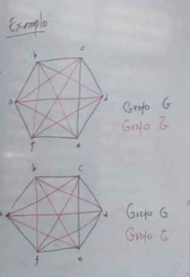

> 🔑 **Consequência importante:**
> Se `G` e `Ḡ` têm os mesmos `n` vértices, então `G ∪ Ḡ = Kₙ` (grafo completo).

---

## 13. Grafo Bipartido

Um grafo `G` é **bipartido** se seus vértices podem ser divididos em **dois grupos disjuntos** `V₁` e `V₂`, de modo que **toda aresta** conecte um vértice de `V₁` a um vértice de `V₂`.

> ⚠️ Não existe aresta entre dois vértices do mesmo grupo.

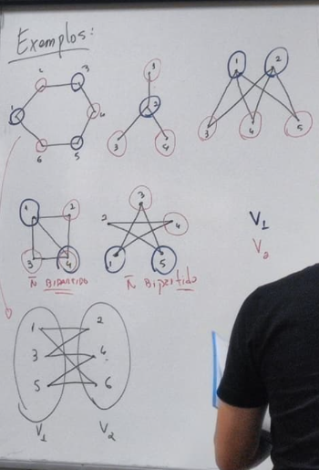

---

## 14. Isomorfismo

Dois grafos `G` e `H` são **isomorfos** (`G ≅ H`) se existe uma função bijetora:

```
f: V(G) → V(H)
```

tal que `(x,y) ∈ A(G)` **se e somente se** `(f(x), f(y)) ∈ A(H)`.

> 💡 Grafos isomorfos têm a **mesma estrutura**, só os rótulos dos vértices mudam.

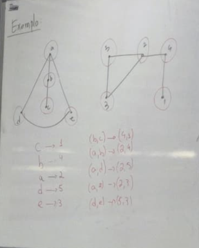

---

### ✅ Checklist para Verificar Isomorfismo

Para dois grafos serem isomorfos, **todos** os itens abaixo devem ser verdadeiros:

- [ ] Mesmo número de vértices `|V|`
- [ ] Mesmo número de arestas `|A|`
- [ ] Mesma sequência de graus (ordenada)
- [ ] Existência de uma correspondência que preserve as adjacências

**Exemplo:**

| Grafo A | Grafo B |
|---------|---------|
| V = {1, 2, 3} | V = {A, B, C} |
| A = {1-2, 2-3} | A = {A-B, B-C} |

Correspondência: `1→A`, `2→B`, `3→C` ✅ São isomorfos!

> ⚠️ Se qualquer item do checklist falhar, os grafos **não são** isomorfos e você pode parar ali.

---

## 15. Coloração de Grafos

### Definições

| Termo | Definição |
|-------|-----------|
| **k-coloração** | Associação de cores `{1, 2, ..., k}` aos vértices |
| **Grafo k-colorido** | Vértices adjacentes têm cores **diferentes** |
| **Número cromático `X(G)`** | Menor número de cores para colorir `G` corretamente |

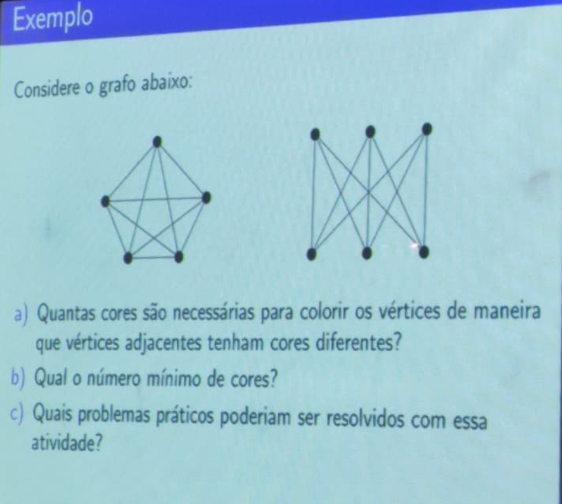

### 🗺️ Coloração de Mapas

Um mapa pode ser modelado como grafo: regiões são vértices, e regiões que se tocam são adjacentes.

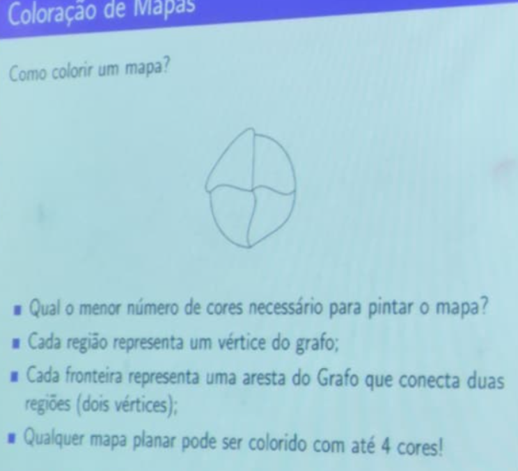

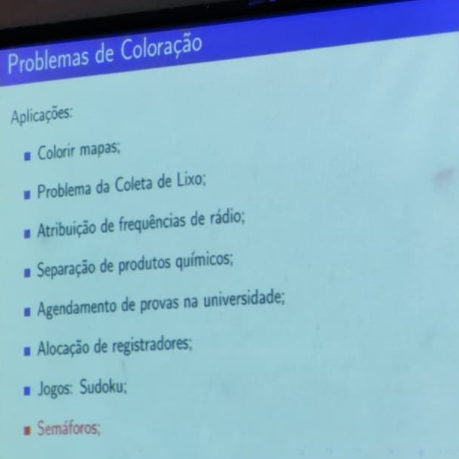

> 🌍 **Teorema das 4 Cores:** Todo mapa planar pode ser colorido com no máximo 4 cores.

---

## 16. Percursos em Grafos

| Conceito | Definição |
|----------|-----------|
| **Percurso** | Sequência de vértices onde cada par consecutivo tem uma aresta |
| **Trilha** | Percurso **sem arestas repetidas** |
| **Caminho** | Trilha **sem vértices repetidos** |
| **Percurso fechado** | Inicia e termina no **mesmo vértice** |
| **Circuito** | Trilha **fechada** |
| **Ciclo** | Caminho **fechado** |
| **Comprimento** | Número de **arestas** do percurso |

> 📝 **Hierarquia para memorizar:**
> ```
> Percurso  ⊃  Trilha (sem aresta repetida)  ⊃  Caminho (sem vértice repetido)
>   ↓                ↓                                 ↓
> Fechado       Circuito                           Ciclo
> ```

---

## 17. Grafo Conectado

Um grafo `G` é **conectado** se para **qualquer par de vértices** `x` e `y`, existe um caminho de `x` até `y`.

> 💡 Um grafo desconectado tem "ilhas" de vértices sem ligação entre si.

> 🔵 **Teorema:** Se todo vértice de `G` tem grau **≥ 2**, então `G` possui um **ciclo**.

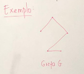

---

## 18. Circuito Euleriano

Um **Circuito Euleriano** é uma **trilha fechada** que percorre **todas as arestas** de `G` exatamente uma vez.

### 🔑 Teorema de Euler

> Um grafo é **Euleriano** se, e somente se:
> 1. For **conectado**
> 2. **Todos** os vértices tiverem grau **par**


---

## 19. Ciclo Hamiltoniano

Um **Ciclo Hamiltoniano** é um ciclo que passa por **todos os vértices** de `G` exatamente uma vez.

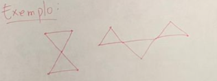

> ⚠️ Diferença-chave:
> - **Euleriano** → passa por todas as **arestas**
> - **Hamiltoniano** → passa por todos os **vértices**

> 🔵 **Teorema:** Se todo vértice de `G` tem grau **≥ 2**, então `G` possui um ciclo (não necessariamente Hamiltoniano).

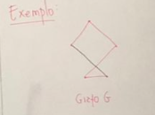

---

## 20. Vértice de Corte e Fórmula de Euler

### Vértice de Corte

Um **vértice de corte** é um vértice cuja **remoção** (junto com suas arestas) **aumenta** o número de componentes conectados do grafo.

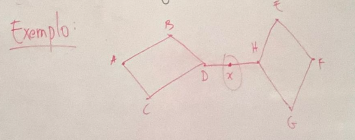

---

### 📐 Fórmula de Euler (para Grafos Planares)

Para um grafo **planar** e **conectado**, com `V` vértices, `E` arestas e `F` faces:

```
V - E + F = 2
```

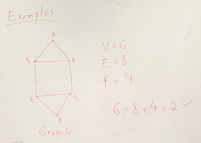

> 💡 Não esqueça de contar a **face externa** (o "exterior" do grafo desenhado no plano) no total de faces `F`.

---

## 21. Planaridade

Um grafo é **planar** se pode ser desenhado no plano **sem que nenhuma aresta se cruze** com outra.

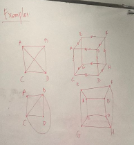

> 🔎 **Dica:** K₅ e K₃,₃ são os dois grafos "base" não-planares (Teorema de Kuratowski). Se um grafo contiver uma subdivisão de K₅ ou K₃,₃, ele **não é planar**.

---

## ⚙️ Problemas Clássicos

### 🌳 Árvore de Extensão Mínima

**Problema:** Dado um grafo com pesos nas arestas, encontrar o subgrafo que **conecta todos os vértices** com o **menor custo total** (menor soma de pesos).

**Aplicações:** Redes de telecomunicação, infraestrutura elétrica, rodovias.

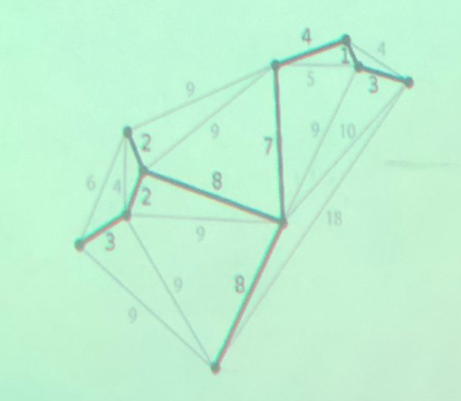

---

### 🌊 Problema do Fluxo Máximo

**Problema:** Dado um dígrafo com capacidades nas arestas, qual o **maior fluxo** possível da fonte até o sumidouro?

**Aplicações:** Redes elétricas, transporte de fluidos, distribuição de produtos.

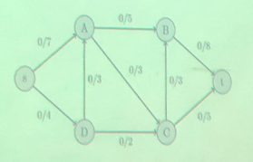

---

## 🧠 Resumo Final — Tabela de Bolso

| Conceito | Palavra-chave |
|----------|--------------|
| Grafo | `G = (V, A)` |
| Simples | Sem loop, sem multi-aresta |
| k-Regular | Todos com grau `k` |
| Completo (Kₙ) | Todo par conectado, `n(n-1)/2` arestas |
| Bipartido | Vértices em 2 grupos, arestas só entre grupos |
| Isomorfismo | Mesma estrutura, rótulos diferentes |
| Euleriano | Conectado + todos os graus pares |
| Hamiltoniano | Passa por todos os vértices |
| Planar | Desenhável sem cruzamento de arestas |
| Número cromático | Mínimo de cores para colorir sem conflito |
| Vértice de corte | Remoção desconecta o grafo |
| Fórmula de Euler | `V - E + F = 2` (grafo planar conectado) |

---

> 📚 **Dica de estudo:** Para cada definição, tente **construir um exemplo próprio** e verificar as propriedades. 
>
> Bons estudos e boa prova a todos! 💪